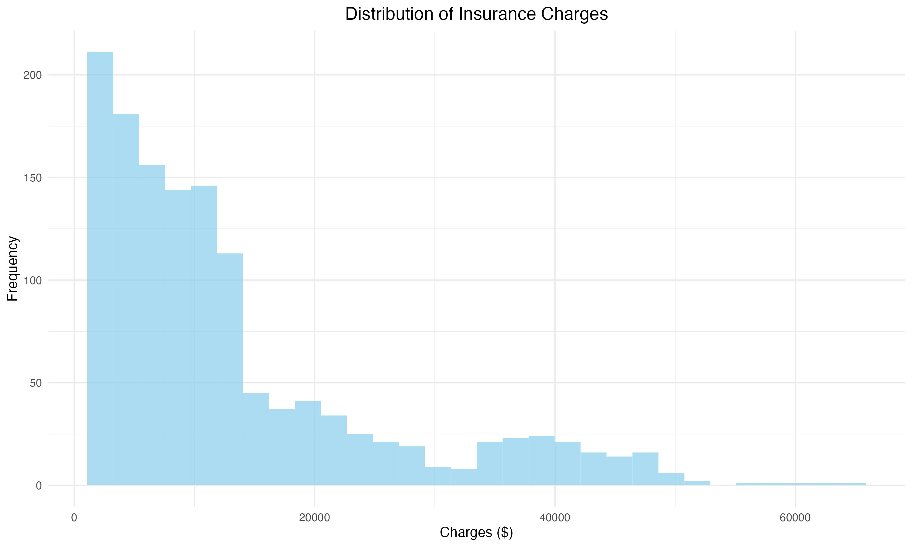
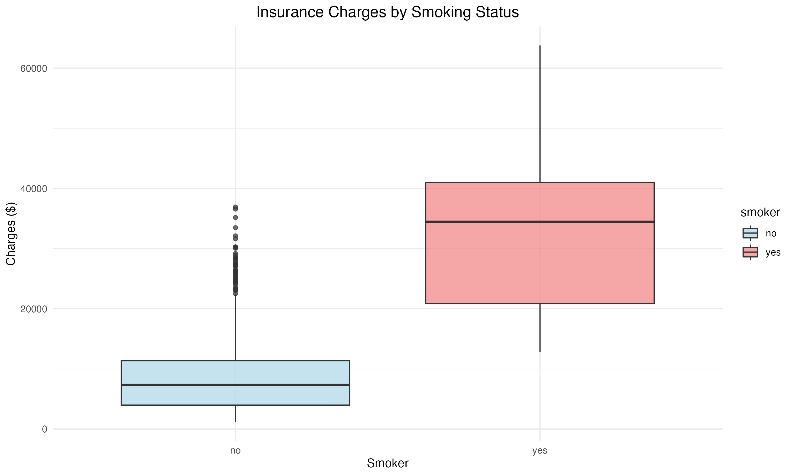
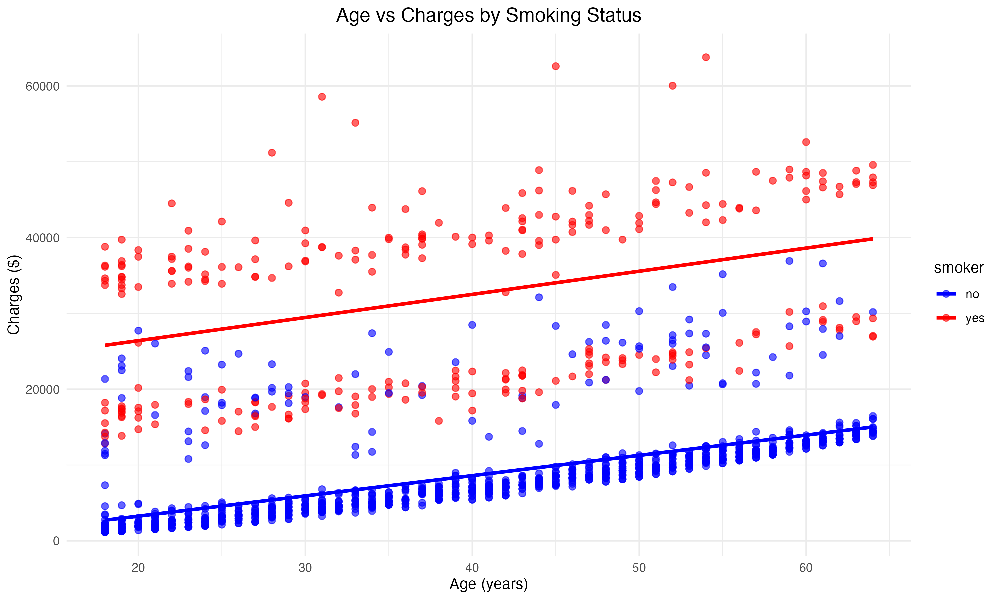
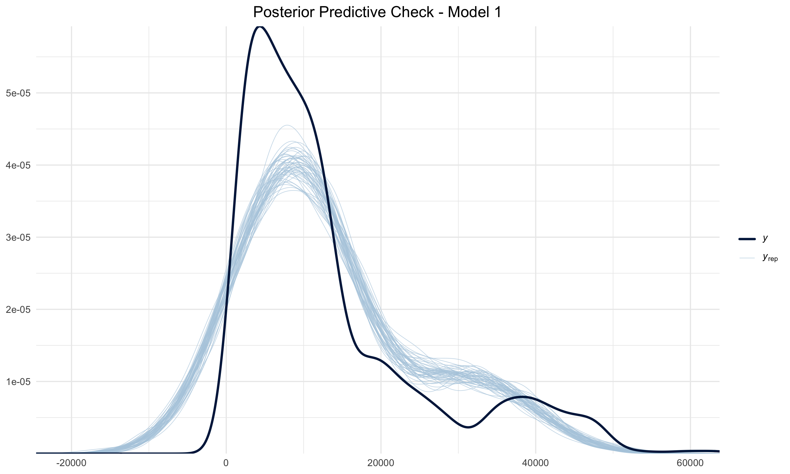
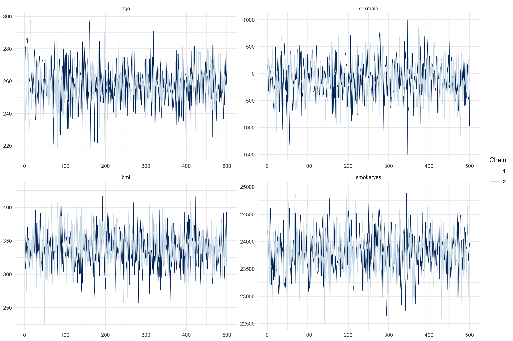
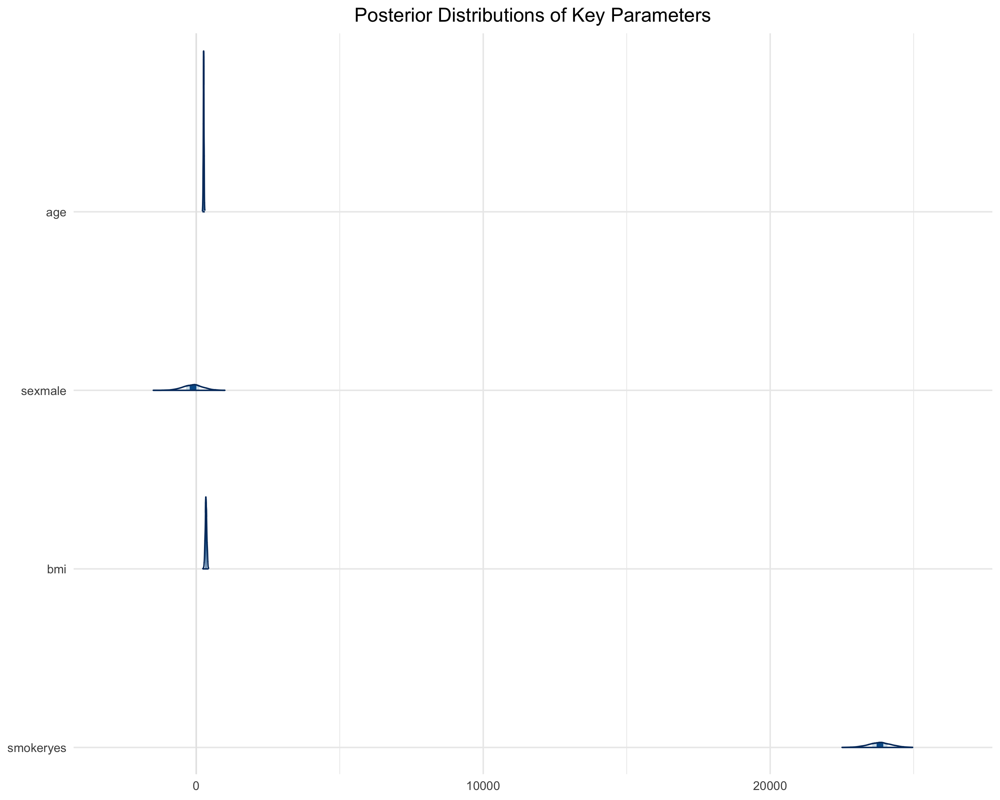
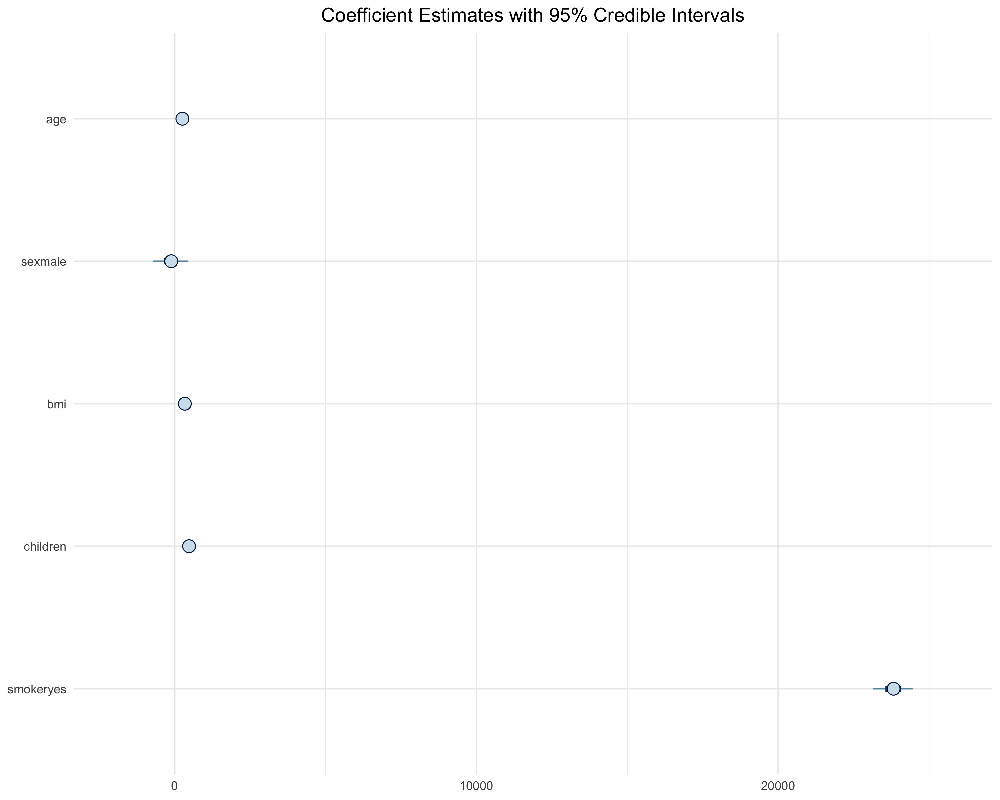
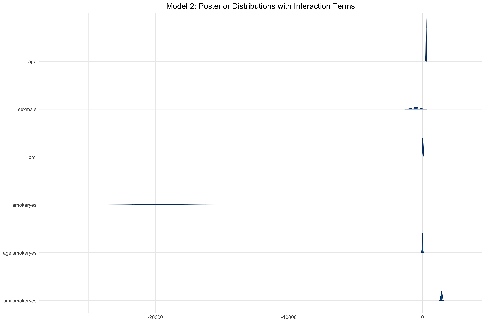
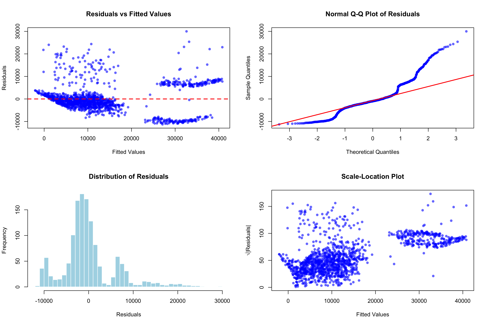
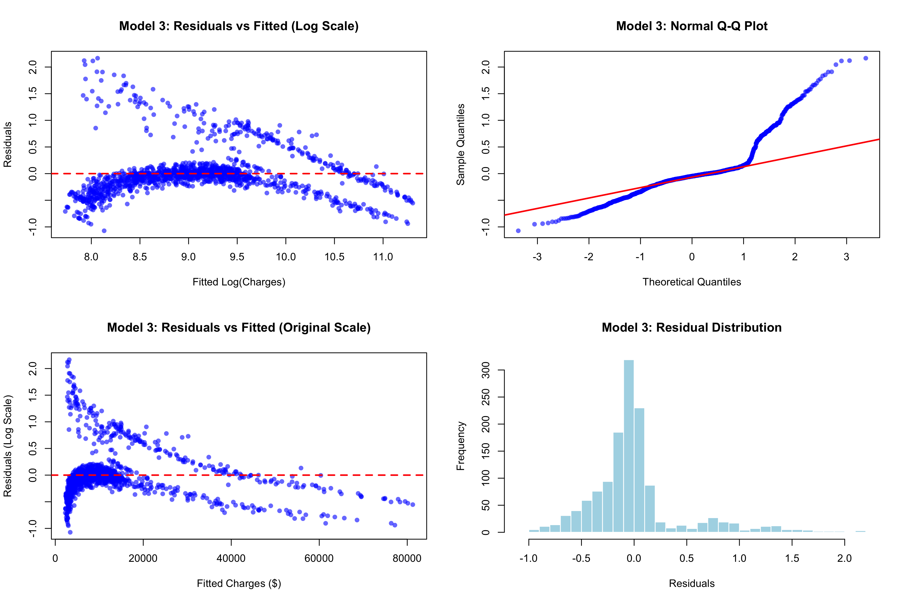

# Bayesian Insurance Analysis

A comprehensive Bayesian statistical analysis of insurance charges using R and the `rstanarm` package. This project explores the relationship between demographic/health factors and insurance costs through multiple hierarchical Bayesian models.

## Overview

This analysis implements four progressively complex Bayesian regression models to predict insurance charges:

1. **Model 1**: Basic Bayesian linear regression
2. **Model 2**: Adds interaction terms (age×smoking, BMI×smoking)  
3. **Model 3**: Log-transformed response variable
4. **Model 4**: Combined log transformation with interactions (most comprehensive)

## Dataset

The analysis uses an insurance dataset with the following variables:
- `age`: Age of the insured
- `sex`: Gender (male/female)
- `bmi`: Body Mass Index
- `children`: Number of dependents
- `smoker`: Smoking status (yes/no)
- `region`: Geographic region (northeast, northwest, southeast, southwest)
- `charges`: Insurance charges (target variable)

## Key Features

### Model Comparison
- Leave-one-out cross-validation (LOO-CV) for robust model selection
- Bayesian R-squared comparisons across all models
- Information criteria analysis

### Comprehensive Diagnostics
- MCMC convergence diagnostics (Rhat statistics, trace plots)
- Posterior predictive checks
- Residual analysis and normality tests
- Scale-location plots for heteroscedasticity assessment

### Effect Analysis
- Posterior summaries with credible intervals
- Probability statements for effect directions
- Multiplicative effects and percentage increases (for log-scale models)
- Interaction effect quantification

### Uncertainty Quantification
- Full posterior predictive distributions for new observations
- 95% credible intervals for all parameters
- Uncertainty propagation through model predictions

## Requirements

```r
# Required R packages
library(rstanarm)     # Bayesian modeling
library(tidyverse)    # Data manipulation
library(bayesplot)    # Bayesian visualization
library(ggplot2)      # Plotting
library(posterior)    # Posterior analysis
library(loo)          # Model comparison
```

## Usage

Run the complete analysis:

```r
source("bayesian_insurance_analysis.R")
```

The script performs:
1. Exploratory data analysis with visualizations
2. Sequential model fitting with MCMC sampling
3. Model comparison using LOO cross-validation
4. Posterior analysis and effect estimation
5. Predictive modeling with uncertainty quantification
6. Comprehensive model validation

## Model Architecture

### Priors
- **Models 1-2**: Weakly informative Normal(0, 10000) priors
- **Models 3-4**: More informative Normal(0, 10) priors for log-scale

### MCMC Configuration
- 4 parallel chains
- 2000 iterations per chain
- Fixed seed (123) for reproducibility

### Key Findings

The analysis reveals:
- Strong association between smoking status and insurance charges
- Age and BMI effects on insurance costs
- Significant interactions between smoking and other risk factors
- Improved model fit with log transformation and interactions

## Visualizations

The analysis generates comprehensive visualizations that reveal key insights about insurance charge patterns and model performance:

### Exploratory Data Analysis

The initial data exploration reveals important patterns in the insurance dataset:


*The distribution of insurance charges shows a right-skewed pattern with most charges concentrated in the lower range and a long tail of high-cost cases.*


*Smoking status dramatically affects insurance charges, with smokers showing significantly higher median costs and greater variability.*


*The relationship between age and charges differs substantially between smokers and non-smokers, with smokers showing steeper cost increases with age.*

### Bayesian Model Diagnostics

The Bayesian analysis includes rigorous diagnostic procedures to ensure model reliability:


*Posterior predictive checks validate that the model generates realistic data distributions matching the observed charges.*


*MCMC trace plots demonstrate proper chain convergence for all key parameters, ensuring reliable posterior estimates.*

### Parameter Estimation and Uncertainty

The Bayesian framework provides complete uncertainty quantification for all model parameters:


*Posterior distributions show the uncertainty in parameter estimates, with smoking having the largest and most certain effect.*


*Coefficient plots with 95% credible intervals reveal which factors significantly influence insurance charges.*


*Model 2 incorporates interaction terms, showing how smoking modifies the effects of age and BMI on insurance costs.*

### Model Validation and Diagnostics

Comprehensive residual analysis ensures model assumptions are met:


*Residual diagnostics for Model 1 show patterns that suggest the need for transformation or more complex modeling.*


*Model 3 diagnostics demonstrate improved residual patterns after log transformation, with better normality and homoscedasticity.*

**Key Visualization Insights:**
- **Right-skewed charge distribution** motivates log transformation in Models 3-4
- **Strong smoking effects** appear consistently across all model specifications
- **MCMC convergence** confirms reliable Bayesian inference
- **Residual improvements** validate the progression from simple to complex models
- **Interaction effects** reveal nuanced relationships between risk factors

## Project Structure

```
├── bayesian_insurance_analysis.R    # Main analysis script
├── generate_plots.R                 # Script to generate visualizations
├── insurance.csv                    # Dataset
├── Practice.Rproj                   # R project file
├── plots/                           # Generated visualization images
│   ├── 01_charges_distribution.png
│   ├── 02_charges_by_smoking.png
│   ├── 03_age_vs_charges.png
│   ├── 04_posterior_predictive_check.png
│   ├── 05_mcmc_trace.png
│   ├── 06_posterior_distributions.png
│   ├── 07_coefficient_plot.png
│   ├── 08_model2_interactions.png
│   ├── 09_residual_analysis.png
│   └── 10_model3_diagnostics.png
└── README.md                        # This file
```

## Generating Visualizations

To regenerate the visualization images:

```r
source("generate_plots.R")
```

This will create all plots in the `plots/` directory with high-resolution PNG format suitable for documentation.

## Technical Notes

- Models 3 and 4 use log-transformed responses requiring back-transformation via `exp()` for interpretation
- Large model objects may require significant memory for MCMC sampling
- All visualizations use `ggplot2` with `theme_minimal()` for clean presentation
- The analysis includes comprehensive residual diagnostics for all models
